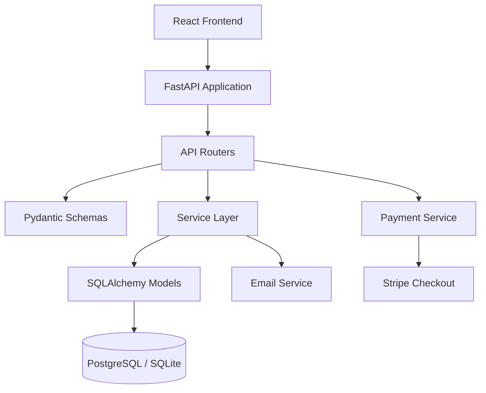

# Product Inventory Management System

A full-stack **Product Inventory Management System** built with **FastAPI**, **React**, **SQLAlchemy**, **PostgreSQL**, **Docker**, and a production-style **pytest automation framework**.

The application supports product creation, listing, searching, sorting, category filtering, stock adjustment, soft deletion, low-stock email alerts, and Stripe checkout session creation. The repository is also designed to demonstrate strong backend testing practices for API, service, database, contract, security, boundary, and equivalence-class testing.

---

## Table of Contents

- [Features](#features)
- [Tech Stack](#tech-stack)
- [Architecture](#architecture)
- [Repository Structure](#repository-structure)
- [Backend Flow](#backend-flow)
- [API Endpoints](#api-endpoints)
- [Environment Configuration](#environment-configuration)
- [Run Locally](#run-locally)
- [Run With Docker](#run-with-docker)
- [Database Migrations](#database-migrations)
- [Testing Framework](#testing-framework)
- [Common Test Commands](#common-test-commands)
- [Frontend Setup](#frontend-setup)
- [Logging and Error Handling](#logging-and-error-handling)
- [Known Notes](#known-notes)
- [Interview Walkthrough](#interview-walkthrough)

---

## Features

### Product Management

- Create a product with name, description, category, price, and quantity.
- Get all active products with pagination.
- Search products by ID, name, description, or category.
- Filter products by category.
- Sort products by ID, name, category, price, quantity, or creation date.
- Get one product by product ID.
- Update product fields partially using PATCH.
- Soft delete products instead of permanently deleting rows.
- Fetch unique product categories.

### Inventory and Stock

- Adjust stock using positive or negative deltas.
- Prevent stock quantity from becoming negative.
- Trigger low-stock notification logic when quantity reaches the configured threshold.

### Payments

- Create Stripe checkout sessions for product purchase flow.
- Payment service is isolated and mockable for tests.

### Platform and DevOps

- Dockerized backend, frontend, and PostgreSQL database.
- Alembic migration support.
- Environment-based configuration.
- Request logging middleware with request IDs.
- Centralized exception handling.
- CORS configured for local frontend access.

### Testing

- Unit tests for service logic.
- API integration tests with FastAPI `TestClient`.
- Database integration tests.
- Contract tests against OpenAPI schema.
- Security/input-hardening tests.
- Boundary value tests.
- Equivalence partitioning tests.
- Mocked email and Stripe tests.
- Optional Docker-backed pytest orchestration.

---

## Tech Stack

### Backend

- Python 3.11
- FastAPI
- SQLAlchemy
- Pydantic
- PostgreSQL
- SQLite for lightweight local/test execution
- Alembic
- Gunicorn
- Uvicorn workers
- Stripe SDK

### Frontend

- React 18
- Axios
- React Icons
- Custom CSS
- Nginx container for production-style frontend serving

### Testing

- Pytest
- FastAPI TestClient
- pytest markers
- pytest fixtures
- Docker SDK for Python
- Mocking with pytest monkeypatch/mocker patterns
- Contract/schema validation helpers

### DevOps

- Docker
- Docker Compose
- Environment files
- Shell entrypoint
- Health checks
- Named PostgreSQL volume

---

## Architecture



The backend follows a layered architecture:

```text
Request
  -> FastAPI route
  -> Pydantic request validation
  -> Service/business logic
  -> SQLAlchemy ORM
  -> Database
  -> Pydantic response model
  -> JSON response
```

This separation makes the code easier to test because routes, services, schemas, and database behavior can be validated independently.

---

## Repository Structure

```text
product-inventory-main/
├── app/
│   ├── api/
│   │   └── routes/
│   │       ├── payment.py
│   │       └── product.py
│   ├── core/
│   │   ├── api_paths.py
│   │   ├── config.py
│   │   ├── exception_handlers.py
│   │   ├── exceptions.py
│   │   ├── logging_config.py
│   │   └── request_logging.py
│   ├── db/
│   │   ├── base.py
│   │   └── session.py
│   ├── models/
│   │   └── product.py
│   ├── schemas/
│   │   ├── payment.py
│   │   └── product.py
│   ├── services/
│   │   ├── email_service.py
│   │   ├── payment_service.py
│   │   └── product_service.py
│   └── main.py
├── alembic/
│   ├── versions/
│   ├── env.py
│   └── script.py.mako
├── frontend/
│   ├── public/
│   ├── src/
│   │   ├── api/
│   │   │   └── productApi.js
│   │   ├── App.js
│   │   ├── index.js
│   │   └── *.css
│   ├── Dockerfile
│   └── package.json
├── tests/
│   ├── data/
│   ├── fakeapi/
│   ├── fixtures/
│   ├── mocks/
│   ├── schemas/
│   ├── utils/
│   ├── conftest.py
│   ├── docker_orchestrator.py
│   ├── test_email_service.py
│   ├── test_openapi_contract.py
│   ├── test_payments.py
│   ├── test_product_service.py
│   ├── test_product_service_db.py
│   ├── test_products.py
│   └── test_products_security.py
├── Dockerfile
├── docker-compose.yml
├── entrypoint.sh
├── requirements.txt
├── pytest.ini
├── alembic.ini
├── swagger.YAML
└── README.md
```

---

## Backend Flow

### Application Startup

`app/main.py` creates the FastAPI application, configures middleware, registers exception handlers, exposes health/root routes, and mounts product and payment routers under `/api/v1`.

Startup flow:

```text
setup_logging()
  -> create FastAPI app
  -> create database tables during lifespan startup
  -> add request logging middleware
  -> add CORS middleware
  -> register exception handlers
  -> include product router
  -> include payment router
```

### Product API Flow

```text
app/api/routes/product.py
  -> receives API request
  -> validates payload using app/schemas/product.py
  -> calls app/services/product_service.py
  -> reads/writes app/models/product.py
  -> commits through SQLAlchemy session
  -> returns Pydantic response
```

### Payment API Flow

```text
app/api/routes/payment.py
  -> receives checkout request
  -> validates payload using app/schemas/payment.py
  -> calls app/services/payment_service.py
  -> creates Stripe checkout session
  -> returns checkout session ID and URL
```

---

## API Endpoints

Base URL:

```text
http://localhost:8000/api/v1
```

### Health and Metadata

| Method | Endpoint | Description |
|---|---|---|
| GET | `/health` | Health check |
| GET | `/` | Root application info |
| GET | `/api/v1` | API index |

### Products

| Method | Endpoint | Description |
|---|---|---|
| POST | `/api/v1/products` | Create product |
| GET | `/api/v1/products` | List products with pagination, search, filtering, sorting |
| GET | `/api/v1/products/categories` | Get unique product categories |
| GET | `/api/v1/products/{product_id}` | Get one product |
| PATCH | `/api/v1/products/{product_id}` | Update product |
| PATCH | `/api/v1/products/{product_id}/stock` | Adjust stock quantity |
| DELETE | `/api/v1/products/{product_id}` | Soft delete product |

### Payments

| Method | Endpoint | Description |
|---|---|---|
| POST | `/api/v1/payments/checkout` | Create Stripe checkout session |

---

## Example API Requests

### Create Product

```bash
curl -X POST "http://localhost:8000/api/v1/products" \
  -H "Content-Type: application/json" \
  -d '{
    "name": "Wireless Mouse",
    "description": "Bluetooth ergonomic mouse",
    "category": "Electronics",
    "price": 29.99,
    "quantity": 50
  }'
```

### List Products

```bash
curl "http://localhost:8000/api/v1/products?page=1&limit=10&sort_by=created_at&sort_order=desc"
```

### Search Products

```bash
curl "http://localhost:8000/api/v1/products?search=mouse"
```

### Filter by Category

```bash
curl "http://localhost:8000/api/v1/products?category=Electronics"
```

### Update Product

```bash
curl -X PATCH "http://localhost:8000/api/v1/products/<product_id>" \
  -H "Content-Type: application/json" \
  -d '{
    "price": 24.99,
    "quantity": 40
  }'
```

### Adjust Stock

```bash
curl -X PATCH "http://localhost:8000/api/v1/products/<product_id>/stock" \
  -H "Content-Type: application/json" \
  -d '{
    "delta": -5
  }'
```

### Soft Delete Product

```bash
curl -X DELETE "http://localhost:8000/api/v1/products/<product_id>"
```

### Create Checkout Session

```bash
curl -X POST "http://localhost:8000/api/v1/payments/checkout" \
  -H "Content-Type: application/json" \
  -d '{
    "product_id": "product-id-here",
    "product_name": "Wireless Mouse",
    "unit_amount": 2999,
    "quantity": 1,
    "currency": "usd"
  }'
```

---

## Environment Configuration

The project uses environment variables through Pydantic settings.

### Common Variables

| Variable | Purpose | Example |
|---|---|---|
| `DATABASE_URL` | Database connection string | `postgresql://postgres:postgres@db:5432/inventory_db` |
| `APP_ENV` | Runtime environment | `local`, `test`, `docker` |
| `LOG_LEVEL` | Logging level | `INFO` |
| `LOW_STOCK_THRESHOLD` | Quantity threshold for low-stock alert | `5` |
| `ALERT_EMAIL_FROM` | Sender email for alerts | `inventory@example.com` |
| `ALERT_EMAIL_TO` | Recipient email for alerts | `admin@example.com` |
| `SMTP_HOST` | SMTP host | `localhost` |
| `SMTP_PORT` | SMTP port | `1025` |


## Run Locally

### 1. Create and activate virtual environment

```bash
python -m venv venv
source venv/bin/activate
```

For Windows:

```bash
python -m venv venv
venv\Scripts\activate
```

### 2. Install dependencies

```bash
pip install -r requirements.txt
```

### 3. Create `.env`

```bash
cp app/.env.example .env
```

If the example file does not contain all needed values, use the sample `.env` from the [Environment Configuration](#environment-configuration) section.

### 4. Run the backend

```bash
uvicorn app.main:app --reload --port 8000
```

Backend URLs:

```text
Application: http://localhost:8000
Swagger UI:   http://localhost:8000/docs
ReDoc:        http://localhost:8000/redoc
Health:       http://localhost:8000/health
```

---

## Run With Docker

### Prerequisites

- Docker
- Docker Compose

### Start full stack

```bash
docker compose up --build
```

### Access services

```text
Frontend: http://localhost:3000
Backend:  http://localhost:8000
Docs:     http://localhost:8000/docs
Health:   http://localhost:8000/health
```

### Stop containers

```bash
docker compose down
```

### Reset database volume

Use this only when you want to delete all persisted PostgreSQL data:

```bash
docker compose down -v
```

### Important Docker Port Note

The backend entrypoint starts Gunicorn on container port `8000`:

```bash
gunicorn app.main:app -k uvicorn.workers.UvicornWorker -b 0.0.0.0:8000
```

So the backend service in `docker-compose.yml` should normally map:

```yaml
ports:
  - "8000:8000"
```

If your compose file has `8000:8010`, the backend may start correctly inside the container but not be reachable from the host on `localhost:8000`.

---

## Database Migrations

Alembic is configured for database migrations.

### Run migrations

```bash
alembic upgrade head
```

### Create a new migration

```bash
alembic revision --autogenerate -m "describe change"
```

### Migration flow in Docker

The Docker entrypoint runs migrations before starting the API server:

```bash
alembic upgrade head
gunicorn app.main:app -k uvicorn.workers.UvicornWorker -w 4 -b 0.0.0.0:8000
```

---

## Testing Framework

This repository contains a strong pytest-based automation framework. It is not only testing the API endpoints; it also validates service logic, database behavior, OpenAPI contracts, security cases, boundaries, equivalence classes, and mocked integrations.

### Test Architecture

```text
tests/
├── conftest.py                  # pytest hooks, plugins, Docker option
├── config.py                    # centralized test configuration
├── docker_orchestrator.py        # optional Docker SDK orchestration
├── fixtures/
│   └── client_fixtures.py        # API clients and app clients
├── fakeapi/
│   ├── request_client.py         # reusable request wrapper
│   └── product_inventory.py      # readable product API client
├── data/
│   ├── product_payloads.py       # valid payloads
│   └── invalid_product_payloads.py
├── schemas/
│   ├── requests.py               # request schema expectations
│   └── responses.py              # response schema expectations
├── mocks/
│   └── email_mocks.py            # email mock helpers
├── utils/
│   ├── api_paths.py              # shared endpoint constants for tests
│   ├── payload_converter.py
│   └── response_validator.py
├── test_products.py              # API product tests
├── test_product_service.py       # unit tests for service logic
├── test_product_service_db.py    # DB integration tests
├── test_openapi_contract.py      # OpenAPI contract tests
├── test_payments.py              # payment tests with Stripe mocked
├── test_email_service.py         # email alert tests
└── test_products_security.py     # security/input-hardening tests
```

### Pytest Markers

Markers are registered in `pytest.ini`:

| Marker | Meaning |
|---|---|
| `unit` | Fast isolated tests using mocks |
| `integration` | API or DB integration tests |
| `equivalence` | Equivalence partitioning tests |
| `boundary` | Boundary value analysis tests |
| `docker` | Docker orchestration tests |
| `api` | API-level tests |
| `security` | Input hardening/security tests |
| `smoke` | Critical happy-path tests |
| `regression` | Regression tests |
| `negative` | Invalid/error scenario tests |
| `contract` | OpenAPI/contract validation tests |

### Test Flow

```text
pytest starts
  -> tests/conftest.py sets APP_ENV=test and DATABASE_URL
  -> pytest loads fixtures from tests/fixtures/client_fixtures.py
  -> tests create products using fake API helper
  -> API response is validated
  -> service/database behavior is asserted
  -> external dependencies like email and Stripe are mocked
```

### Why the testing framework is strong

- Test data is separated from test logic.
- API helper methods make tests readable.
- Fixtures centralize setup and teardown.
- Mocking prevents real emails or Stripe calls.
- Boundary and equivalence tests validate Pydantic and business rules.
- Contract tests protect the OpenAPI specification.
- Docker orchestration allows tests to run against a real containerized backend.

---

## Common Test Commands

### Run all tests

```bash
pytest -q
```

### Run with verbose output

```bash
pytest -v
```

### Run only unit tests

```bash
pytest -m unit
```

### Run only integration tests

```bash
pytest -m integration
```

### Run API tests

```bash
pytest -m api
```

### Run security tests

```bash
pytest -m security
```

### Run boundary tests

```bash
pytest -m boundary
```

### Run equivalence partitioning tests

```bash
pytest -m equivalence
```

### Run contract tests

```bash
pytest -m contract
```

### Run one test file

```bash
pytest tests/test_products.py -v
```

### Run one test by name

```bash
pytest -k "create_product" -v
```

### Run Docker-backed tests

```bash
pytest --run-docker -v
```

The Docker-backed test mode starts a PostgreSQL test container and a backend test container using the Docker SDK.

---

## Frontend Setup

### Install dependencies

```bash
cd frontend
npm install
```

### Start frontend locally

```bash
npm start
```

Frontend runs at:

```text
http://localhost:3000
```

### Build frontend

```bash
npm run build
```

The React frontend calls backend APIs using Axios through `frontend/src/api/productApi.js`.

---

## Logging and Error Handling

### Logging

The application configures structured logging in `app/core/logging_config.py`.

Logs are written to:

```text
logs/app.log
```

The app also logs to stdout, which is useful for Docker logs:

```bash
docker logs inventory_backend
```

### Request Logging

`RequestLoggingMiddleware` adds request-level logs and attaches an `X-Request-ID` header to responses.

This helps trace API requests across logs.

### Error Handling

Centralized exception handlers manage:

- HTTP exceptions
- Pydantic validation errors
- Unexpected server errors

Unexpected errors return a safe generic response instead of exposing internal details.

---

## Known Notes

### Soft delete and unique product names

Products are soft deleted using `is_active=False`. The service checks duplicate names only among active products. However, the database model defines `Product.name` as unique.

That means recreating a product with the same name after soft deletion may still fail at the database level because the old inactive row still exists.

Possible fixes:

1. Remove the database-level unique constraint and enforce uniqueness only among active products in service logic.
2. Use a partial unique index for active products only, if using PostgreSQL.
3. Rename/archive the product name during soft delete.

### Docker port mapping

The backend starts on container port `8000`. Make sure Docker Compose maps `8000:8000`, not `8000:8010`, unless the backend bind port is changed.

### Secrets

Do not commit real API keys, SMTP credentials, Stripe secrets, or production database passwords.

Use `.env` files locally and secret managers in real environments.

## Useful Commands Summary

```bash
# Backend local
python -m venv venv
source venv/bin/activate
pip install -r requirements.txt
uvicorn app.main:app --reload --port 8000

# Frontend local
cd frontend
npm install
npm start

# Docker full stack
docker compose up --build

docker compose down

# Tests
pytest -q
pytest -m unit
pytest -m integration
pytest -m api
pytest -m security
pytest --run-docker -v

# Migrations
alembic upgrade head
alembic revision --autogenerate -m "migration message"
```

---

## Project Summary

This project demonstrates:

- Backend API development with FastAPI.
- Database modeling with SQLAlchemy.
- Request and response validation with Pydantic.
- PostgreSQL containerization with Docker Compose.
- React frontend integration.
- Clean service-layer architecture.
- Centralized configuration, logging, and exception handling.
- Professional pytest framework design.
- API, database, service, contract, security, boundary, and equivalence testing.
- Mocking of external integrations such as email and Stripe.
